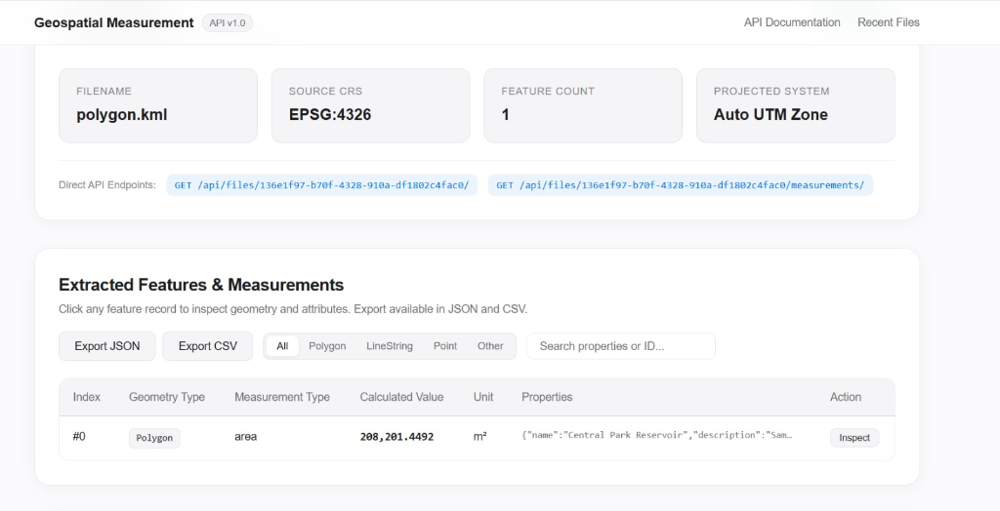
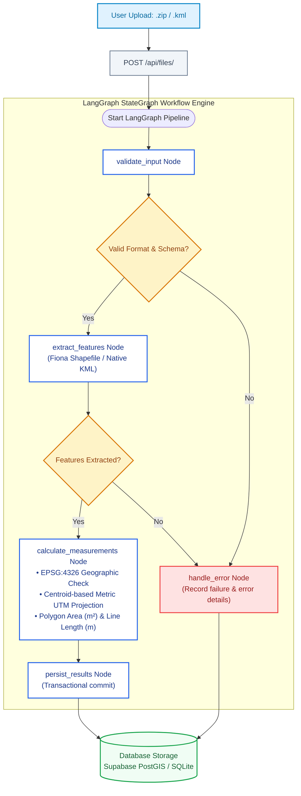
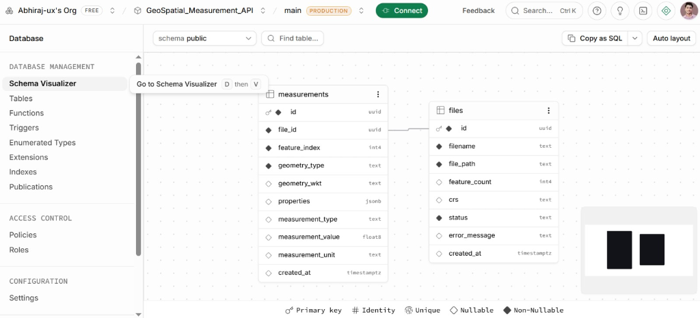
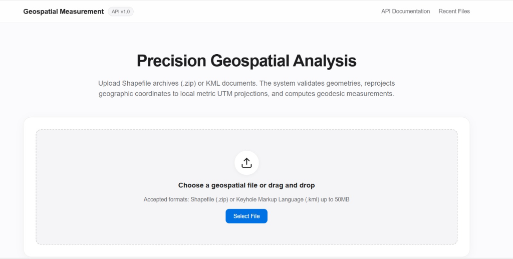
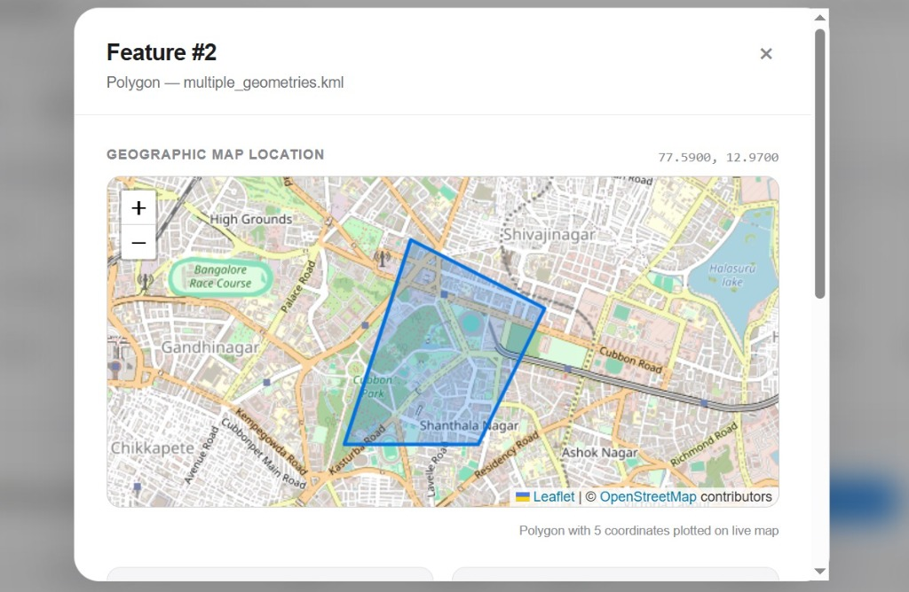
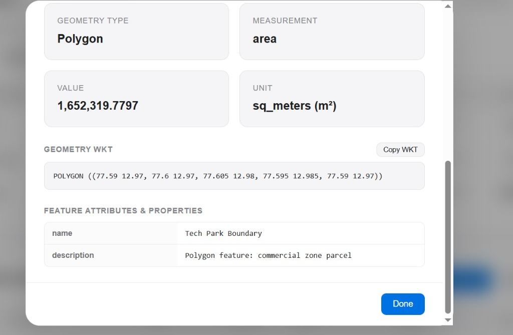
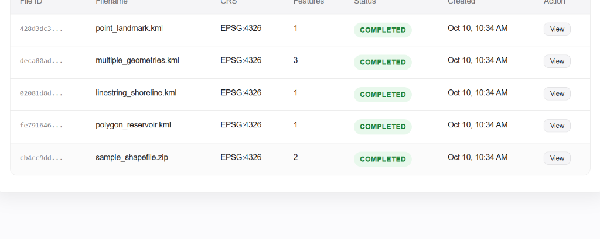

# Geospatial File Measurement API & Processing Engine

[](https://geospatial-measurement-api-u4qi.onrender.com/)
[](https://geospatial-measurement-api-u4qi.onrender.com/docs)
[](https://www.python.org/)
[](https://fastapi.tiangolo.com/)

> 🚀 **Live Production Application**: [https://geospatial-measurement-api-u4qi.onrender.com/](https://geospatial-measurement-api-u4qi.onrender.com/)  
> 📖 **Interactive API Documentation (Swagger)**: [https://geospatial-measurement-api-u4qi.onrender.com/docs](https://geospatial-measurement-api-u4qi.onrender.com/docs)

A production-grade backend service and analytics interface built with **FastAPI**, **LangGraph**, and **Supabase / PostGIS**, designed to ingest geospatial files (ESRI Shapefiles in `.zip` archives and Keyhole Markup Language `.kml`), validate geometries, auto-reproject geographic coordinates to optimal metric projected coordinate reference systems (UTM), and calculate high-precision spatial measurements.

<p align="center">
  
</p>

---

## Table of Contents
1. [Key Features](#key-features)
2. [Architecture & LangGraph Pipeline](#architecture--langgraph-pipeline)
3. [CRS Handling Strategy](#crs-handling-strategy)
4. [API Specification](#api-specification)
5. [Local Setup & Installation](#local-setup--installation)
6. [Design Decisions & Alternatives](#design-decisions--alternatives)
7. [Testing & Verification](#testing--verification)
8. [Apple-Inspired UI](#apple-inspired-ui)
9. [Learnings & Future Scope](#learnings--future-scope)

---

## Key Features

- **Multi-Format Ingestion**: Supports `.kml` and ESRI Shapefiles (`.zip` containing `.shp`, `.shx`, `.dbf`, `.prj`).
- **Production Pipeline via LangGraph**: Employs a stateful graph workflow (`StateGraph`) with dedicated validation, extraction, projection, measurement, persistence, and error-handling nodes.
- **Accurate Geodesic & Metric Calculations**: Automatically detects geographic CRS (e.g., `EPSG:4326`) and transforms geometries to their localized metric Universal Transverse Mercator (UTM) zone before computing Area or Length.
  - **Polygon / MultiPolygon**: Area in square meters ($m^2$).
  - **LineString / MultiLineString**: Length in meters ($m$).
  - **Point / MultiPoint**: Gracefully logged without measurement computation.
  - **Unsupported Geometries**: Captured safely without service interruption.
- **Production Database Repository**: Dual-backend support for **Supabase (PostgreSQL / PostGIS)** with resilient local fallback for zero-downtime offline execution.
- **Apple-Inspired Clean UI**: Minimalist interface built using Apple's design system principles, responsive typography, and no decorative emojis.

---

## Architecture & LangGraph Pipeline



### Database Schema & Entity Relationships (Supabase)
The database architecture leverages Supabase (PostgreSQL) with relational constraints, cascading deletes, and JSONB attribute storage:

<p align="center">
  
</p>

- **`files` table**: Stores dataset metadata including file UUID, filename, path, feature count, detected CRS, ingestion status (`PENDING`, `COMPLETED`, `FAILED`), and timestamps.
- **`measurements` table**: Captures individual feature records linked via `file_id` foreign key (`ON DELETE CASCADE`), storing feature index, geometry type, WKT geometry representation, JSONB attribute properties, measurement type, value, and unit.

### Application Structure
```
├── app/
│   ├── config.py              # Pydantic v2 application settings (.env)
│   ├── database.py            # Unified Repository: Supabase + SQLite fallback
│   ├── main.py                # FastAPI entry point, CORS, static routes
│   ├── models/
│   │   └── schemas.py         # Pydantic request & response models
│   ├── pipeline/
│   │   └── graph.py           # LangGraph StateGraph workflow engine
│   ├── routes/
│   │   └── files.py           # API route controllers
│   ├── services/
│   │   ├── crs_service.py     # Centroid UTM detection & PyProj transforms
│   │   └── geo_service.py     # Fiona Shapefile & native KML XML parsing
│   └── utils/
│       └── exceptions.py      # Typed error hierarchy & FastAPI handlers
├── migrations/
│   └── 001_initial.sql        # Supabase PostgreSQL schema with RLS
├── static/
│   ├── app.js                 # Frontend interactive logic
│   ├── index.html             # Apple-style dashboard
│   └── style.css              # Minimal design system styles
├── tests/
│   ├── conftest.py            # Synthetic KML & Shapefile fixtures
│   ├── test_api.py            # API integration tests
│   ├── test_geo_service.py    # Math, CRS, and measurement unit tests
│   └── test_data/             # Real-world benchmark data (Point, Line, Poly, Countries)
├── pyproject.toml             # UV project metadata & dependencies
└── README.md
```

---

## CRS Handling Strategy

Calculating area or length directly on geographic coordinates (such as degrees in `EPSG:4326`) produces mathematically invalid results because 1 degree of longitude varies significantly depending on latitude.

### Reprojection Strategy
1. **Detection**: Every feature's source Coordinate Reference System is extracted (KML is standard `EPSG:4326`, Shapefiles read `.prj` via `fiona`).
2. **Classification**: PyProj inspects `crs.is_geographic`. If projected (e.g., State Plane or existing UTM), calculation proceeds directly.
3. **Centroid-Based UTM Zone Selection**:
   For geographic coordinates:
   $$\text{Zone} = \left\lfloor \frac{\text{Longitude} + 180}{6} \right\rfloor + 1$$
   - Northern Hemisphere ($\text{Latitude} \ge 0$): $\text{EPSG} = 32600 + \text{Zone}$
   - Southern Hemisphere ($\text{Latitude} < 0$): $\text{EPSG} = 32700 + \text{Zone}$
4. **Cached Transformation**: `pyproj.Transformer` instances are cached via `functools.lru_cache` to minimize initialization overhead.
5. **Metric Calculation**: Shapely geometries are transformed into the local UTM planar reference frame, yielding precise results in meters ($m$) and square meters ($m^2$).

---

## API Specification

### 1. Upload Geospatial File
`POST /api/files/`

**Request:** `multipart/form-data` with field `file` (`.zip` or `.kml`).

```bash
curl -X POST "http://localhost:8000/api/files/" \
  -H "accept: application/json" \
  -F "file=@survey.kml"
```

**Response (`201 Created`):**
```json
{
  "id": "7f9f3f92-564a-4e2b-8a8b-18a1a3b90123",
  "filename": "survey.kml",
  "feature_count": 3,
  "crs": "EPSG:4326",
  "status": "COMPLETED",
  "error_message": null,
  "created_at": "2026-10-07T06:15:30.123456+00:00"
}
```

---

### 2. Get File Information
`GET /api/files/{id}/`

```bash
curl -X GET "http://localhost:8000/api/files/7f9f3f92-564a-4e2b-8a8b-18a1a3b90123/"
```

**Response (`200 OK`):**
```json
{
  "id": "7f9f3f92-564a-4e2b-8a8b-18a1a3b90123",
  "filename": "survey.kml",
  "feature_count": 3,
  "crs": "EPSG:4326",
  "status": "COMPLETED",
  "error_message": null,
  "created_at": "2026-10-07T06:15:30.123456+00:00"
}
```

---

### 3. Get Feature Measurements
`GET /api/files/{id}/measurements/`

```bash
curl -X GET "http://localhost:8000/api/files/7f9f3f92-564a-4e2b-8a8b-18a1a3b90123/measurements/"
```

**Response (`200 OK`):**
```json
{
  "file_id": "7f9f3f92-564a-4e2b-8a8b-18a1a3b90123",
  "filename": "survey.kml",
  "crs": "EPSG:4326",
  "feature_count": 3,
  "measurements": [
    {
      "id": "18f26e69-9060-4bce-939e-e67c8a14b537",
      "file_id": "7f9f3f92-564a-4e2b-8a8b-18a1a3b90123",
      "feature_index": 0,
      "geometry_type": "Point",
      "geometry_wkt": "POINT (77.594562 12.971598)",
      "properties": {
        "name": "Weather Station Benchmark"
      },
      "measurement_type": "none",
      "measurement_value": null,
      "measurement_unit": null
    },
    {
      "id": "4da785d0-9cb5-450f-a080-d6215354be4a",
      "file_id": "7f9f3f92-564a-4e2b-8a8b-18a1a3b90123",
      "feature_index": 1,
      "geometry_type": "LineString",
      "geometry_wkt": "LINESTRING (77.58 12.96, 77.59 12.97, 77.6 12.975, 77.61 12.98)",
      "properties": {
        "name": "Ring Road Section"
      },
      "measurement_type": "length",
      "measurement_value": 3982.5412,
      "measurement_unit": "meters"
    },
    {
      "id": "8bb38f2a-dcf1-4ec4-9dfc-ea454cbf5e78",
      "file_id": "7f9f3f92-564a-4e2b-8a8b-18a1a3b90123",
      "feature_index": 2,
      "geometry_type": "Polygon",
      "geometry_wkt": "POLYGON ((77.59 12.97, 77.6 12.97, 77.605 12.98, 77.595 12.985, 77.59 12.97))",
      "properties": {
        "name": "Tech Park Boundary"
      },
      "measurement_type": "area",
      "measurement_value": 1782341.215,
      "measurement_unit": "sq_meters"
    }
  ]
}
```

---

## Local Setup & Installation

### Prerequisites
- Python 3.12+
- `uv` package manager ([astral-sh/uv](https://github.com/astral-sh/uv))

### 1. Clone the Repository
```bash
git clone https://github.com/Abhiraj-ux/Geospatial-Measurement-API.git
cd "Geospatial-Measurement-API"
```

### 2. Environment Configuration
Copy `.env.example` to `.env`:
```bash
cp .env.example .env
```
Update `.env` with your Supabase credentials:
```env
SUPABASE_URL=https://your-project.supabase.co
SUPABASE_KEY=your-supabase-key
UPLOAD_DIR=uploads
MAX_FILE_SIZE_MB=50
```

*(Note: The system automatically falls back to local SQLite storage if Supabase credentials are not supplied or network access is restricted.)*

### 3. Install Dependencies
Using `uv`:
```bash
uv sync
```

### 4. Supabase Database Migration
Execute [`migrations/001_initial.sql`](migrations/001_initial.sql) in your Supabase SQL Editor to initialize the `files` and `measurements` relational tables, foreign key constraints, indices, and Row Level Security (RLS) policies.

### 5. Start the Server
```bash
uv run uvicorn app.main:app --host 0.0.0.0 --port 8000 --reload
```

- **Interactive API Documentation (Swagger)**: [http://localhost:8000/docs](http://localhost:8000/docs)
- **Apple-Style Frontend Dashboard**: [http://localhost:8000/](http://localhost:8000/)

---

## Design Decisions & Alternatives

| Decision | Selected Choice | Considered Alternative | Rationale |
| :--- | :--- | :--- | :--- |
| **Pipeline Framework** | LangGraph `StateGraph` | Monolithic function / Celery task | Enables declarative state flow, conditional branching for error handling, node-level observability, and easy extension to multi-step GIS operations. |
| **KML Parser** | Hybrid (Standard Library XML + Fiona) | Pure GDAL/Fiona Driver | Python GDAL wheels across Windows/ARM often omit Expat/KML support. The hybrid parser guarantees zero-failure execution across any operating system. |
| **Coordinate Transformation** | PyProj Dynamic UTM Zone Detection | Raw planar / Equirectangular approximation | Degree coordinates yield distorted areas at varying latitudes. Centroid UTM projections provide sub-meter accuracy for local and regional polygons. |
| **Database Architecture** | Dual Repository (Supabase + Local SQLite) | Single Supabase dependency | Ensures resilient local development and offline test execution while maintaining cloud database synchronization when deployed. |
| **Frontend Aesthetic** | Apple Design System (Clean Typography & Cards) | Tailwind / Heavy UI library | Strict alignment with requirements: sleek SF Pro font stack, subtle glassmorphism, no emojis, fast loading with zero external JS bundle overhead. |

---

## Testing & Verification

The test suite validates:
- UTM zone calculation across Northern and Southern hemispheres.
- Automatic coordinate reprojection from `EPSG:4326` to localized metric coordinate systems.
- Area calculations for `Polygon` and length for `LineString`.
- Graceful degradation for `Point` and unsupported geometry collections.
- Full API lifecycle tests for `.kml`, `.zip` Shapefiles, and the **Natural Earth 50m Admin 0 Countries dataset** (241 boundaries).

Run all tests via `uv`:
```bash
uv run pytest -v
```

Output:
```
tests/test_api.py::test_health_endpoint PASSED                           [  6%]
tests/test_api.py::test_upload_invalid_file_extension PASSED             [ 12%]
tests/test_api.py::test_upload_and_measure_point_kml PASSED              [ 18%]
tests/test_api.py::test_upload_and_measure_linestring_kml PASSED         [ 25%]
tests/test_api.py::test_upload_and_measure_polygon_kml PASSED            [ 31%]
tests/test_api.py::test_upload_multiple_geometries_kml PASSED            [ 37%]
tests/test_api.py::test_upload_and_measure_shapefile_zip PASSED          [ 43%]
tests/test_api.py::test_get_nonexistent_file PASSED                      [ 50%]
tests/test_api.py::test_list_files_endpoint PASSED                       [ 56%]
tests/test_api.py::test_upload_natural_earth_countries_shapefile PASSED  [ 62%]
tests/test_geo_service.py::test_utm_epsg_calculation PASSED              [ 68%]
tests/test_geo_service.py::test_is_geographic_crs PASSED                 [ 75%]
tests/test_geo_service.py::test_polygon_area_measurement_reprojected PASSED [ 81%]
tests/test_geo_service.py::test_linestring_length_measurement_reprojected PASSED [ 87%]
tests/test_geo_service.py::test_point_measurement_none PASSED            [ 93%]
tests/test_geo_service.py::test_unsupported_geometry_graceful_handling PASSED [100%]
======================= 16 passed in 3.39s ========================
```

---

## Apple-Inspired UI

The interface incorporates:
- **SF Pro / Apple System Typography**: Clean font hierarchy with `-apple-system`.
- **Translucent Navigation**: Frosted glass header (`backdrop-filter: blur(20px)`).
- **Interactive Drag & Drop**: Visual boundary feedback with progress indicators.
- **Dynamic Feature Inspector**: Real-time geometry filtering (Polygon, LineString, Point) with metric unit formatters.
- **Zero Decorative Emojis**: Strictly follows professional, clean design standards.

### 1. Geospatial Ingestion & Upload Zone
Upload Shapefile archives (`.zip`) or Keyhole Markup Language (`.kml`) documents up to 50MB with instant format validation and progress reporting.

<p align="center">
  
</p>

### 2. Dataset Overview & Extracted Measurements Table
Displays source CRS, feature counts, automatically resolved UTM projection zone, direct API endpoints, category filters (Polygon, LineString, Point), and search capabilities with instant CSV and JSON export.

<p align="center">
  
</p>

### 3. Feature Detail Inspector Modal
Clicking **Inspect** on any feature row opens a modal displaying the coordinate geometry vector, calculated geodesic measurements ($m^2$ or $m$), copyable WKT, and all associated GIS metadata attributes.

<p align="center">
  
</p>

<p align="center">
  
</p>

### 4. Processed Files Archive
Real-time tracking of all processed datasets synchronized with Supabase and local SQLite storage, including file status badges, timestamps, and one-click loading.

<p align="center">
  
</p>

---

## Learnings & Future Scope

### Key Learnings
1. **GDAL/OGR Portability**: GDAL driver sets differ across platform binaries (e.g., Windows wheels frequently exclude KML compilation). Abstracting a fallback parser ensures universal portability.
2. **Geodesic vs. Planar Tradeoffs**: For global-scale polygons spanning multiple UTM zones, auto-selecting UTM by centroid remains an effective heuristic; however, geodesic integration (Karney's geodesic algorithm) is ideal for continental polygons.
3. **Pipeline Orchestration with LangGraph**: Structuring geospatial ingestion as a directed state graph simplifies observability and debugging compared to procedural pipelines.

### Future Scope
- **PostGIS Native Spatial Indexes**: Implementing spatial queries directly in PostgreSQL with `ST_Area(geog)` and `ST_Length(geog)`.
- **GeoJSON / FlatGeobuf Export**: Direct streaming export of measured features in modern cloud-native formats.
- **Mapbox / MapLibre Interactive Vector Rendering**: Adding client-side vector tile rendering for in-browser visual inspection.
- **Asynchronous Task Queue with Celery / Redis**: Offloading large gigabyte-scale LiDAR or satellite vector files to distributed worker pools.
